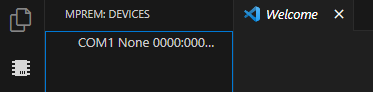
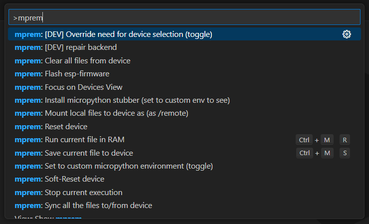

# An mpremote based command system

### Intended use for micro controllers

Works like a charm with ESP-32-WroOM

It can show you all the connected ports and devices

It runs active files on the micro-controller, syncs data back and forth, 
clears the micro-controller and more...

### FYI:
- All of this can be done with mpremote only

- Also take a look at: (https://github.com/Josverl/micropython-stubber)

- For beginners: (https://thonny.org/)